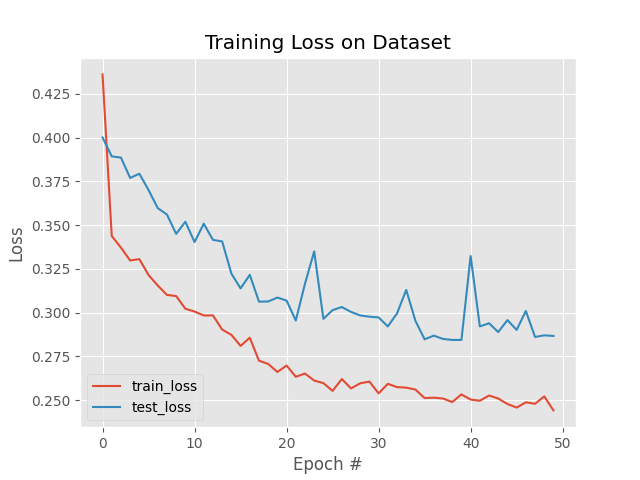
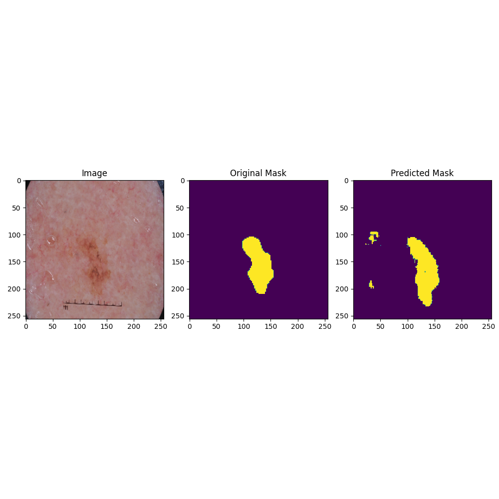
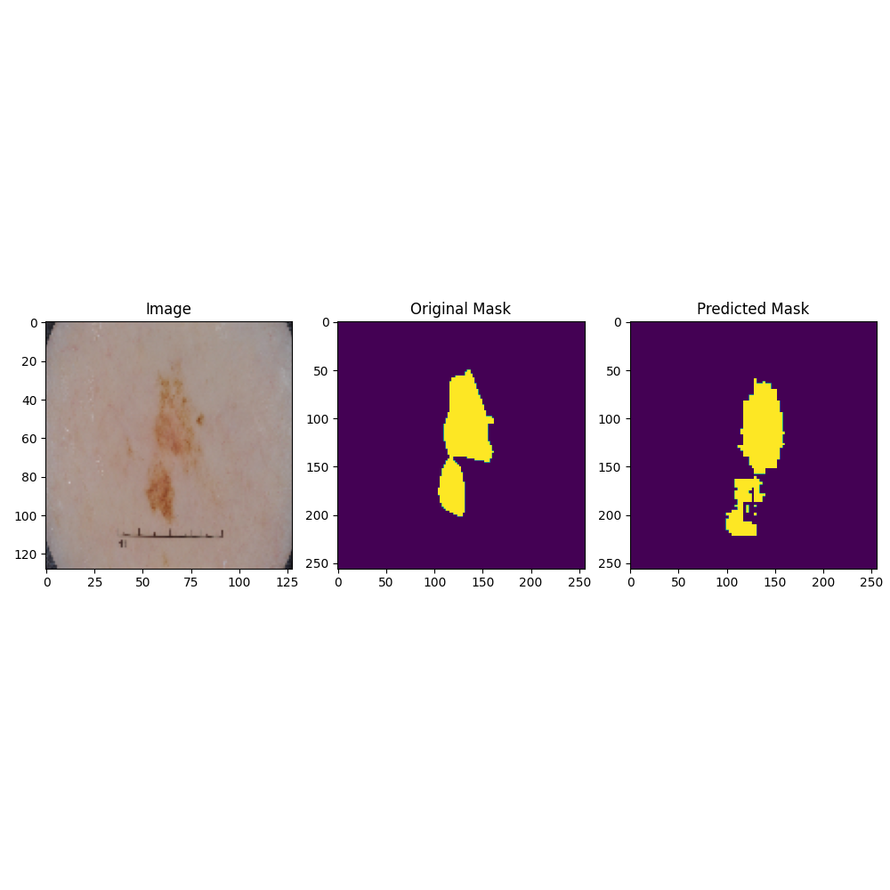
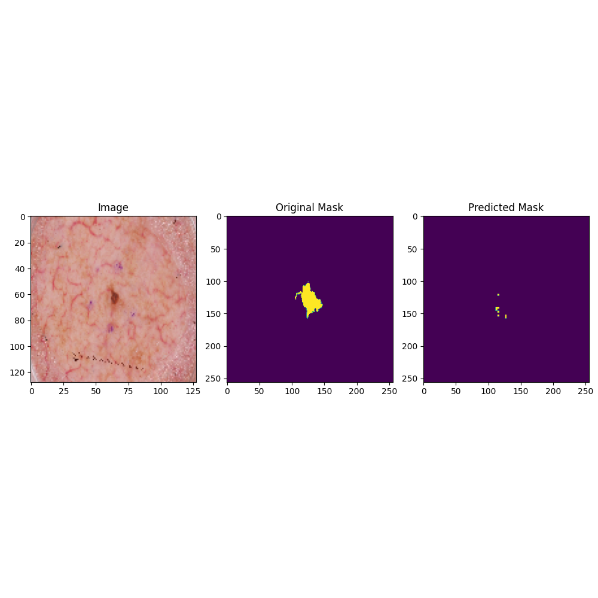
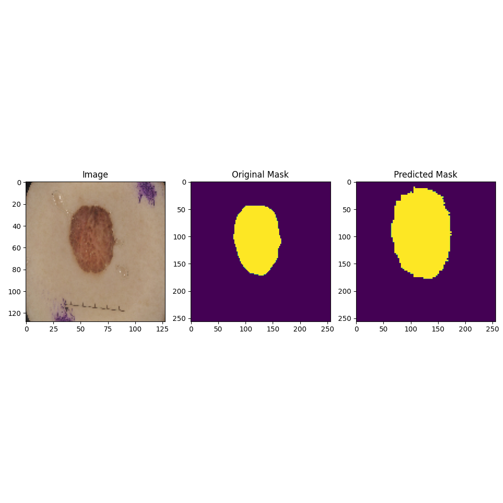
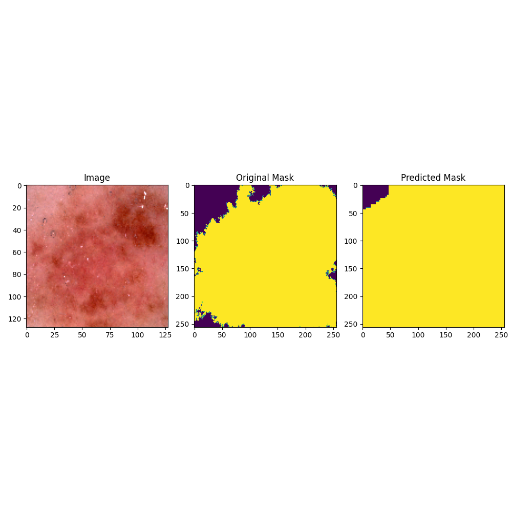
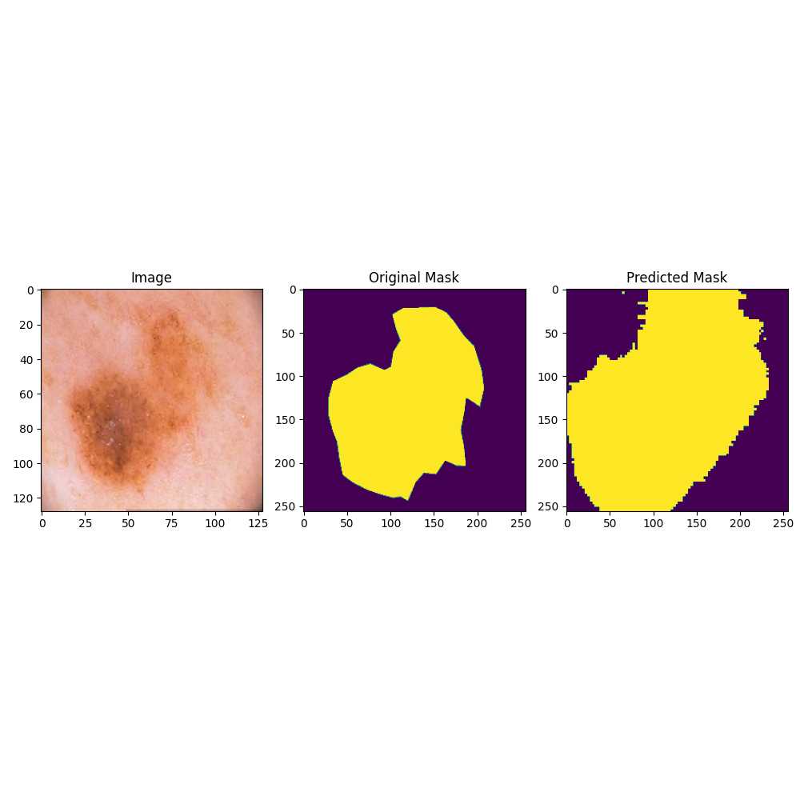

# U-Net Skin Lesion Segmentation

PyTorch U-Net project for binary segmentation of skin lesions in dermoscopic images.

## Project Overview

The model takes a dermoscopic RGB image as input and predicts a binary lesion mask.

### Main components
- Custom image-mask dataset loader
- U-Net encoder-decoder architecture
- Data augmentation
- BCEWithLogitsLoss
- Adam optimizer
- Training/validation loss monitoring
- Qualitative comparison of ground-truth and predicted masks

## Repository Structure

```text
.
├── src/
│   ├── dataset.py
│   ├── model.py
│   ├── train.py
│   └── predict.py
├── data/
│   └── README.md
├── models/
│   ├── README.md
│   └── unet_lesion.pth
├── results/
│   ├── training_curves/
│   │   └── training_loss.png
│   └── predictions/
│       ├── result.png
│       ├── result1.png
│       ├── result2.png
│       ├── result3.png
│       ├── result4.png
│       └── result5.png
├── requirements.txt
├── .gitignore
└── README.md
```

## Model

The U-Net contains an encoder, decoder, skip connections, and a final 1×1 convolution for binary segmentation.

Images and masks are resized to 256×256.

## Training Setup

- Optimizer: Adam
- Learning rate: 0.001
- Batch size: 32
- Epochs: 50
- Loss: BCEWithLogitsLoss
- Train/test split: 85/15

## Training Curve



## Prediction Examples

Each example shows the original dermoscopic image, original mask, and predicted mask.













## Dataset

The original files use ISIC-style image names such as `ISIC_0000232.jpg` and masks such as `ISIC_0000232_segmentation.png`.

The exact dataset release/source was not recorded in the original project, so the dataset itself is not included here.

See `data/README.md` for the expected folder structure.

## Requirements

Install dependencies with:

```bash
pip install -r requirements.txt
```

## Notes

The current code reflects the original experiment and contains some machine-specific paths that should be changed before running on another computer.

For a more portable version, replace hard-coded paths with relative paths or command-line arguments.

## Disclaimer

This project is for research and educational purposes only and is not intended for medical diagnosis or clinical decision-making.
